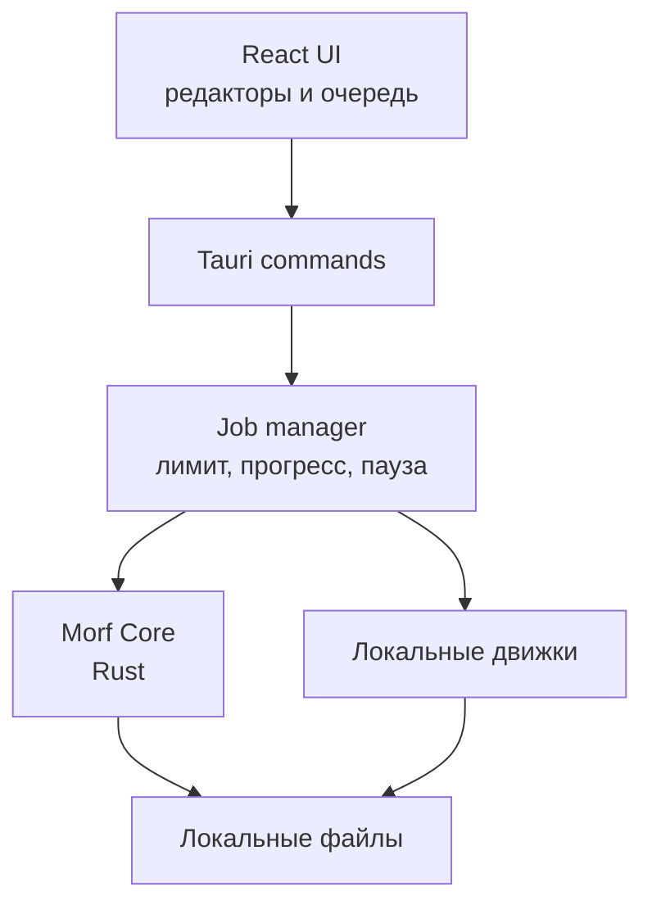

# Morf Alpha 0.1

Лёгкая локальная мастерская для конвертации, быстрых правок, разделения и объединения файлов. Интерфейс написан на React/TypeScript, системная часть — на Rust и Tauri 2.

Текущая версия: `0.1.0-alpha.1`.

Короткий маршрут от архива до установщиков: [START_HERE_RU.md](START_HERE_RU.md).

Morf не загружает пользовательские файлы в облако. Нативные операции выполняются внутри приложения, а тяжёлые форматы передаются установленным на компьютере движкам отдельными аргументами без shell-интерпретации.

## Возможности Alpha

- пакетная конвертация изображений, видео, аудио, документов, данных и исходного кода;
- фоновая очередь с лимитом 1–8 параллельных задач;
- прогресс по файлам, пауза, продолжение и кооперативная отмена;
- пользовательские пресеты;
- прогноз размера результата;
- изменение размеров, fit, поворот, grayscale, качество и аудиобитрейт;
- водяные знаки изображений и видео;
- отдельная дорожка субтитров или вшивание SRT/VTT/ASS в видео;
- NVENC, Apple VideoToolbox, Intel Quick Sync и AMD AMF с откатом на программное кодирование;
- реальный предпросмотр изображений и страниц PDF;
- редактор порядка страниц PDF с индивидуальными масштабом, полями, сдвигом, поворотом и границей;
- PDF без потерь через qpdf или PDF-макет через Poppler + Morf Core;
- разделение PDF, изображений, видео и аудио;
- OCR изображений/PDF в TXT или PDF с текстовым слоем;
- создание и безопасная распаковка ZIP; 7Z/RAR/TAR через 7-Zip;
- просмотр EXIF/XMP/IPTC, перенос совместимых тегов и сохранение очищенной копии;
- собственные пути ко всем движкам и подсказки установки;
- ручное обновление установкой новой версии поверх старой;
- системные file associations — **Open with Morf**;
- история операций и защита исходника от перезаписи.

Полная матрица: [docs/FORMAT_SUPPORT.md](docs/FORMAT_SUPPORT.md).

## Движки

Morf Core остаётся компактным, а тяжёлые возможности подключаются опционально.

| Движок | Назначение |
|---|---|
| Morf Core | растры, структурированные данные, PDF из изображений, ZIP |
| FFmpeg | видео, аудио, кадры, водяные знаки, субтитры |
| LibreOffice | DOC/DOCX, XLS/XLSX, PPT/PPTX, ODF, PDF |
| Pandoc | Markdown, HTML, EPUB |
| qpdf | PDF без потерь, разделение и объединение |
| Poppler | PDF → изображения/текст и миниатюры |
| Tesseract OCR | распознавание изображений и PDF |
| ExifTool | чтение и удаление метаданных |
| 7-Zip | 7Z, RAR, TAR, GZ и другие архивы |

Экран **Инструменты** показывает обнаруженный путь и версию каждого движка. Можно указать собственный executable. Помощник установки показывает официальную страницу и команду для package manager; системное изменение всегда подтверждает пользователь.

## Быстрый старт разработки

Нужны Node.js 22+, Rust 1.85+ и системные зависимости Tauri.

```bash
npm ci
npm run fixtures
npm test
npm run tauri -- dev
```

Production frontend:

```bash
npm run build
```

Локальный установщик:

```bash
npm run tauri -- build
```

Требования Tauri:
[Windows](https://v2.tauri.app/start/prerequisites/#windows),
[macOS](https://v2.tauri.app/start/prerequisites/#macos),
[Linux](https://v2.tauri.app/start/prerequisites/#linux).

## Тесты

`tests/fixtures` содержит реальные небольшие PNG/JPEG, двухстраничный PDF, WAV/MP3/FLAC, MP4, RTF, HTML/Markdown, JSON/YAML/TOML/CSV/XML, TypeScript, SRT, GZip и ZIP.

```bash
npm run fixtures
npm test
cargo test --manifest-path src-tauri/Cargo.toml
```

В CI Rust smoke-тесты выполняют настоящие операции через FFmpeg, qpdf, Poppler, LibreOffice, Tesseract, ExifTool и 7-Zip.

## CI и установщики

`.github/workflows/build.yml` собирает:

- Windows x64;
- macOS x86_64 (Intel);
- macOS arm64 (Apple Silicon);
- Linux x64.

`.github/workflows/release.yml` без дополнительных секретов собирает те же платформы и создаёт черновик GitHub Alpha Release. Выпуск помечается как **Pre-release**. Windows-пакеты не имеют publisher-подписи, а macOS использует бесплатную ad-hoc подпись без нотариализации.

| Платформа | Результаты |
|---|---|
| Windows x64 | NSIS `setup.exe`, MSI |
| macOS Intel | DMG x86_64 |
| macOS Apple Silicon | DMG arm64 |
| Linux x64 | AppImage, DEB, RPM |

Инструкции:

- [загрузка проекта через сайт GitHub](docs/GITHUB_WEB_UPLOAD_RU.md);
- [установка и ручное обновление](docs/INSTALL_AND_UPDATE_RU.md);
- [сборка релиза и необязательная publisher-подпись](docs/RELEASE_SIGNING_RU.md);
- [план тестирования на реальных пользователях](docs/ALPHA_TEST_PLAN_RU.md);
- [точный статус и внешние шаги Alpha](docs/ALPHA_0.1_STATUS_RU.md).

## Архитектура



Ключевые каталоги:

- `src/` — UI, фоновые задачи, пресеты и история;
- `src-tauri/src/` — Rust API и операции;
- `tests/fixtures/` — реальные тестовые файлы;
- `.github/workflows/` — проверки, четыре сборки и release;
- `docs/` — форматная матрица, безопасность, публикация и UX-тест.

## Ограничения Alpha

- Фоновая очередь, подробный прогресс, пауза и отмена в Alpha относятся к пакетной конвертации. Объединение, разделение, OCR, архивы и метаданные выполняются как одна операция с индикатором занятости.
- Пауза и отмена внешнего процесса применяются после текущего файла. Уже полностью созданные результаты не удаляются.
- В PDF-режиме **Макет** исходная страница растрируется; **Без потерь** сохраняет текст и вектор, но не меняет геометрию содержимого.
- Границы медиа-сегментов без перекодирования привязаны к ближайшим ключевым кадрам.
- Наличие конкретных кодеков AVIF/HEIC/аппаратных encoder зависит от сборки FFmpeg.
- Офисный результат зависит от LibreOffice и доступных шрифтов.
- ZIP реализован внутри Morf; внешние архивные форматы требуют 7-Zip.
- Автоматическое скачивание бинарных движков не включено: для него нужен отдельный подписанный manifest с фиксированными версиями, лицензиями и SHA-256 для каждой платформы. Alpha предоставляет безопасный guided installer.
- Встроенного автоматического обновления в Alpha нет. Новая версия устанавливается поверх старой по инструкции; для надёжного сравнения пакетов увеличивайте числовую часть версии.
- Windows SmartScreen и macOS Gatekeeper показывают предупреждения для неподписанного/ненотариализованного Alpha. Платные publisher-сертификаты можно добавить позже независимо от функциональности приложения.

## Лицензия

MIT. У внешних движков свои лицензии; перед встраиванием бинарников в дистрибутив необходимо отдельно проверить условия распространения.
